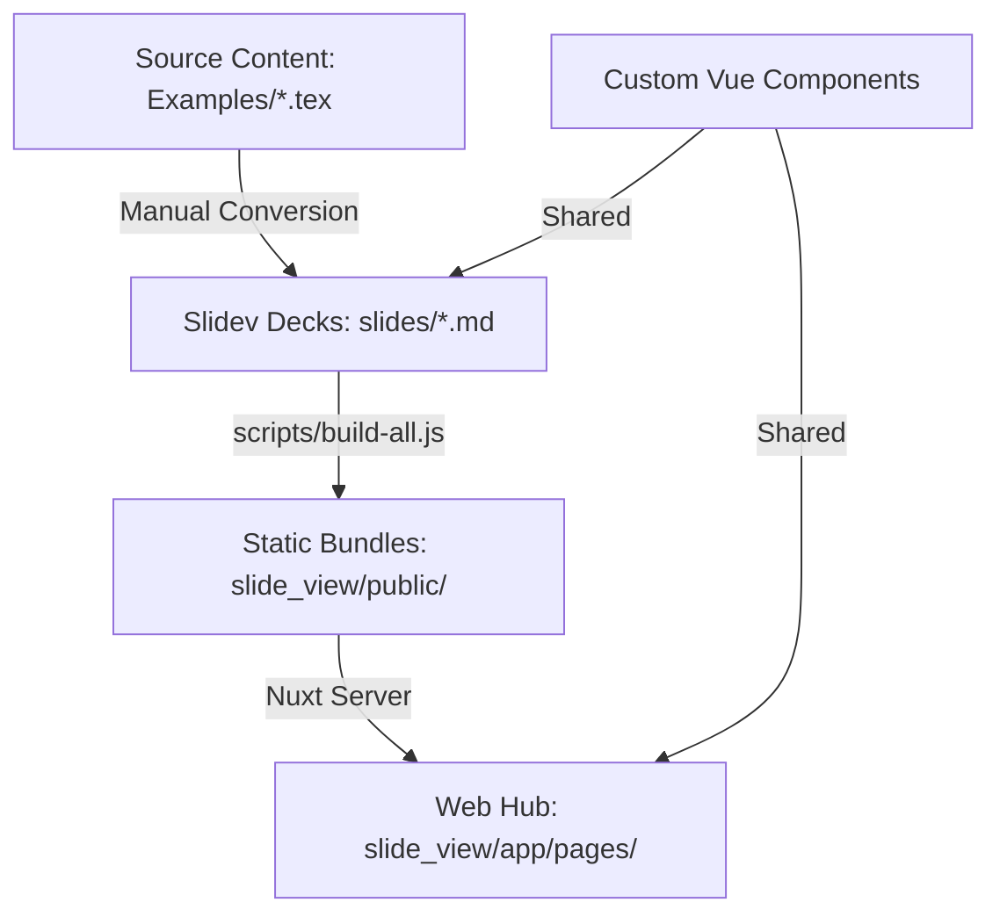

# Slide Hub: Multi-Deck Presentation Archive

Welcome to the **Slide Hub**, a centralized repository hosting elegant, interactive presentations built with [Slidev](https://github.com/slidevjs/slidev) and delivered through a polished [Nuxt](https://nuxt.com/) web hub.

## 🏛️ Project Architecture

This repository uses a dual-core architecture to manage multiple slide decks and serve them through a unified web interface.

### 🏗️ Workflow Visualization



### 📂 Key Components

- **`slides/`**: The core repository of presentations. Each `.md` file represents a distinct Slidev deck.
- **`slide_view/`**: A Nuxt 4 application (Nuxt UI, Tailwind 4) that acts as the frontend hub to discover and browse presentations.
- **`components/`**: Custom reusable Vue components (like `MathBox`, `Keynote`, `SlideImage`) used across multiple presentations.
- **`scripts/build-all.js`**: A build automation script that recursively compiles all Slidev markdown files into static web artifacts stored in the web hub's public directory.
- **`Examples/`**: Original source materials, legacy LaTeX/Beamer `.tex` files for teaching content.

---

## 🚀 Quick Start

### 1. Install Dependencies

Ensure you have [pnpm](https://pnpm.io/) installed, then run:

```bash
pnpm install
```

### 2. View Individual Slides (Dev Mode)

To develop or preview a specific presentation file locally:

```bash
pnpm slidev [path/to/file.md] --open
```

### 3. Build & Sync to Web Hub

To compile all presentations and update the list of slides in the Nuxt web hub:

```bash
# In the root directory
pnpm run build-all
```

This will output all compiled slides into `slide_view/public/`, making them accessible via the Hub.

### 4. Run the Web Hub Locally

To preview the Slide Hub frontend:

```bash
cd slide_view
pnpm dev
```

---

## 🌎 Deployment (Vercel)

This project is optimized for deployment on the **Vercel** platform.

1.  **Framework Preset**: Choose **Nuxt.js** (or Other).
2.  **Root Directory**: `slide_view`.
3.  **Build Command**: `pnpm build-all`.
4.  **Static Directory**: The hub will serve the built decks from the `public` directory.

> [!TIP]
> Ensure the root build command executes `scripts/build-all.js` before the Nuxt build to ensure all static assets are generated.

---

## 📖 Maintenance & Conventions

### 🖋️ Adding New Decks
1.  Add a new `.md` file in `slides/[category]/`.
2.  Run `pnpm run build-all`.
3.  Register the new slide in the navigation menu:
    *   Edit [AppHeader.vue](file:///c:/Users/johan/small%20projects/slidev-test/slide_view/app/components/AppHeader.vue) or individual category pages in `slide_view/app/pages/`.

### 🎓 LaTeX to Slidev Conversion
Detailed mapping rules for migrating LaTeX frames to Slidev sections can be found in [ray_slidev_conversion.md](file:///c:/Users/johan/small%20projects/slidev-test/ray_slidev_conversion.md).

---

Built with ❤️ using **Slidev** and **Nuxt UI**.
